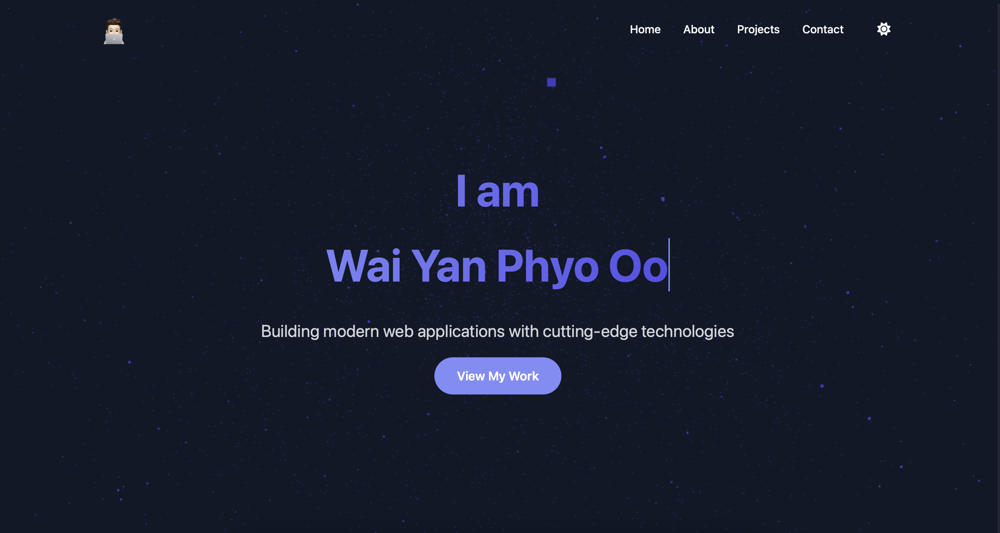
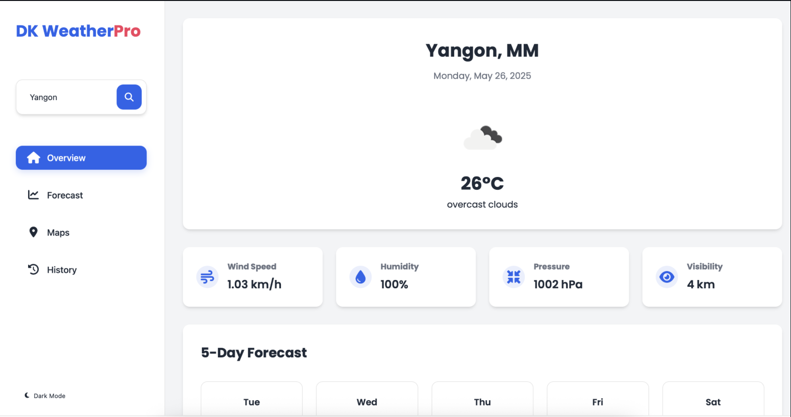

# 💼 Portfolio Website - Wai Yan Phyo Oo

A responsive and modern personal portfolio website built with HTML, CSS, and JavaScript. Features interactive animations, dark/light mode, and smooth mobile navigation.

## 🌐 Live Demo

🔗 [View Website](https://waiyanphyooo21.github.io/waiyan-portfolio/)

## 📸 Screenshots

### 🌙 Dark Mode  

### ☀️ Light Mode  

## 🚀 Features

- Responsive design for all screen sizes
- Particle animation with Three.js
- Typewriter effect in hero section
- Dark/Light mode toggle
- Project cards and contact form
- Font Awesome icons

## 🛠️ Tech Stack

- HTML5  
- CSS3  
- JavaScript  
- Three.js (CDN)  
- Font Awesome (CDN)  
- Git & GitHub

## 💻 Getting Started

1. Clone the repo:
git clone https://waiyanphyooo21.github.io/waiyan-portfolio.git
2. Open `index.html` in your browser or use Live Server in VS Code.

## 📬 Contact

- Email: dm@waiyanphyooo.online
- GitHub: [@waiyanphyooo21](https://github.com/waiyanphyooo21)

## ⭐️ Show Your Support

If you like this project, consider giving it a ⭐️ on [GitHub](https://waiyanphyooo21.github.io/waiyan-portfolio/)!
